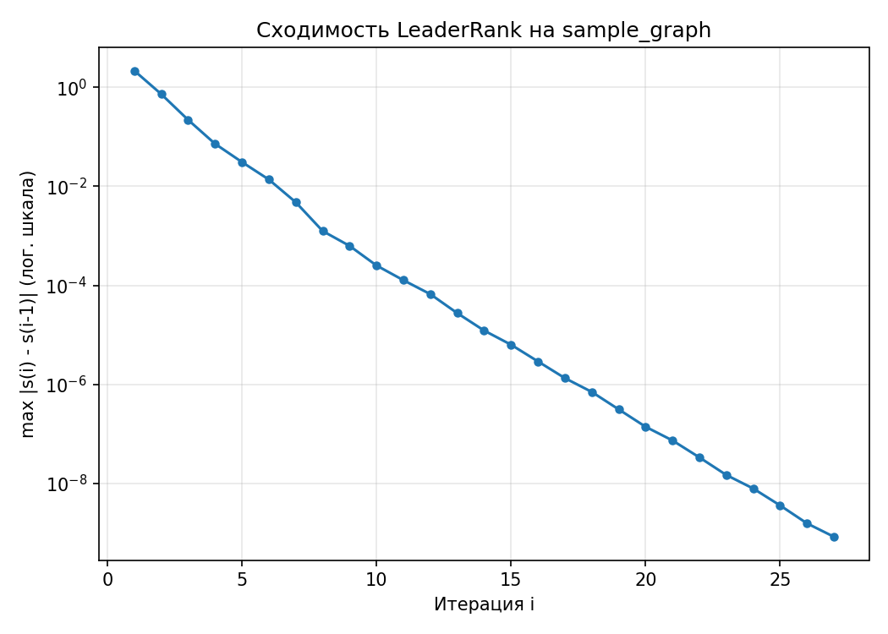

# leaderrank-stream

## Сборка/запуск с докером
```bash
cd leaderrank-stream
docker build -t leaderrank-stream . 
```

Пример запуска для sample_graph

```bash
docker run --rm --memory=256m --memory-swap=256m \
    -v ./sample_graph/edges.csv:/input/graph.csv:ro \
    -v "$(pwd)/out:/data" \
    leaderrank-stream \
    --input /input/graph.csv --output /data/result.csv --threads 4 \
    --eps 1e-6 --max-iters 100
```

Результат появится в `./out/result.csv`.

## Обычная сборка
```bash
cd leaderrank-stream
mkdir build && cd build
cmake .. -DCMAKE_BUILD_TYPE=Release
cmake --build . -j$(nproc)
```

## Запуск
```bash
./build/bin/app --input <path> --output <path> [--threads N] [--eps E] [--max-iters N]
```
Входной файл - csv с колонками `from,to`, разделитель `,`, без лишних символов и с одним переводом строки в конце файла (стандартный csv). Используется 0-индексация.

Пример:
```
from,to
0,1
1,2
2,0
3,0
```

## Про LeaderRank и выбор метрики
Я выбрал LeaderRank, это метрика влиятельности узла в сети. Может использоваться в социальных сетях для поиска влиятельных людей / узлов распространения информации (полезно для маркетинга), в рекомендательных системах, в биологических сетях и т.д.

У PageRank, LeaderRank, Katz похожий смысл метрики, и их "оптимальные" реализации похожи: по сути итеративно умножаем матрицы (+ иногда домножаем на скаляр или прибавляем вектор), поэтому эту реализацию можно легко переделать в PageRank или Katz. Но LeaderRank менее описан, поэтому с ним работать интереснее.
Jaccard, Dice - другой класс задач, показывают насколько "похожи" пары вершин (тоже прикольно, но первые три мне показались более интересными для выполнения задания).

## Алгоритм
В оригинальной статье (Lü L, Zhang Y-C, Yeung CH, Zhou T (2011) "Leaders in Social Networks, the Delicious Case." PLoS ONE 6(6): e21202.) метрика сразу вводится как итеративный процесс "случайного блуждания".

Пусть у нас есть граф $G = (V, E)$. В него добавляется ground вершина, соединенная со всеми вершинами двунаправленными ребрами, получается граф $G' = (V', E')$. Изначальные значения $s_0(i) = 1$ для всех вершин, кроме $s_0(\textrm{ground}) = 0$.

Далее итерации: $s_{i + 1}(j) = \sum_{(v, j) \in E'} \frac{s_{i}(v)}{k^{\textrm{out}}_v}$, где $k^{\textrm{out}}_v$ - исходящая степень вершины $v$ в $G'$.

И для получения финального результата после $i$ шагов: $res(j) = s_{i}(j) + \frac{s_{i}(\textrm{ground})}{k^{\textrm{out}}_{\textrm{ground}}}$ (сливаем все из ground вершины).

По сути, мы сразу получаем "алгоритм": сделать $\textrm{iters}$ шагов, на каждом шаге пробежать по всем ребрам и сделать += к массиву с значениями текущего шага за $O(|E'|) = O(|E| + |V|)$. Массив $k^{\textrm{out}}$ считается тривиально за $O(|E'|)$. В итоге $O(\textrm{iters} \cdot (|E| + |V|))$.

## Количество итераций для сходимости
В оригинальной статье доказано, что такой алгоритм сходится к единственному стационарному состоянию.

Как я понял, "хорошей" (не грубой) оценки скорости сходимости нет: они зависят от конкретного графа.

На практике на тестовых графах я наблюдал монотонную сходимость, похожую на логарифмическую. Например, вот график для графа `sample_graph`:




## Стриминг
Мы считаем что $O(|V|)$ и $O(|E|)$ не умещается в оперативную память. Поэтому граф, данные про итерации и т.д. нужно хранить во внешней памяти. Алгоритм пользуется только "массивами" во внешней памяти, поэтому все, что мы можем сделать - хранить граф / данные про итерации во внешней памяти, а свободную оперативную память использовать как кеш. Причем к массиву с ребрами мы обращаем последовательно, а к массиву с текущем значением метрики случайно. Поэтому просто будем MMapить файлы, а дальше ОС сама будет кешировать /грузить страницами.
Итого $O(\textrm{iters} * (\frac{|E|}{\textrm{batch}} + |V|))$, где $\textrm{batch}$ - сколько читаем за раз. ($|E|$ делим, т.к. доступ к ребрам последовательный, а в случае рандомного доступа кеш не меняет асимптотику).

## Многопоточное выполнение
Очевидно, что такой алгоритм будет упираться не в cpu, а в io. Т. к. у нас ssd/ram (которые обычно умеют параллельно отдавать данные разным ядрам), распараллеливание может помочь лучше утилизировать io.

Каждому треду достается примерно одинаковое количество ребер, с которыми он дальше будет работать (поэтому гипер-узлы не делают один поток узким местом).

В этом алгоритме не нужны сложные примитивы синхронизации, все задачи покрывают обычные атомики и `atomic_ref`.

## Хранение графа и данных шагов
По сути есть 2 способа хранения графа:

В первом мы просто оставляем csv, и читаем (парсим) каждую итерацию. Единственный плюс такого подхода - экономия места, т.к. для хранения ребер нам не нужно создавать новые файлы в другом формате (которые будет суммарного размера $O(|E|)$). Проблем гораздо больше: парсить каждый раз csv долго, масштабируемость затрудняется (если например хотим добавить поддержку parquet, придется лезть в сам код подсчета метрики).

Поэтому я применил второй способ: предварительно перегнать ребра в свой временный удобный формат, который будет проще читать в горячих местах. Таким форматом стали обычные бинарные файлы в которых подряд хранятся пары вершин, описывающие ребра. Каждому потоку достается свой бинарный файл, с которым он будет работать. При такой организации чуть удобнее писать код (особенно, если, например, понадобится добавить свои кеши для каждого потока).

Для подсчета значений метрики на текущей итерации достаточно (и необходимо) хранить информацию про два шага: текущий и предыдущий. Они также хранятся в двух бинарных файлах.

И также для подсчета метрики нужно знать исходящие степени вершин. Их оптимальнее предпосчитать заранее и сохранить в бинарный файл. Это будет гораздо быстрее чем пересчитывать каждую итерацию, и займет $O(|V|)$ памяти, что на фоне $O(|E| + |V|)$ используемой памяти для хранения шагов и ребер не так много.

Еще есть ground вершина, она хранится неявно и все операции с ней обрабатываются отдельно, что позволяет сэкономить $O(|V|)$ памяти на ребрах до всех вершин.

## Тестирование и выводы
Проверить корректность было тяжело, т.к. в известных библиотеках подсчет leaderrank отсутствует. Я взял картинку с примером из оригинальной статьи (https://journals.plos.org/plosone/article/figure/image?size=large&id=10.1371/journal.pone.0021202.g001), перенес этот граф, результаты сошлись (также проверил на "лесе" из таких графов что многопоточка работает) + ллмка написала тесты для проверки на общую адекватность (проверялись базовые свойства).

Затем я взял датасет LiveJournal social network (https://snap.stanford.edu/data/soc-LiveJournal1.html), подогнал под свой формат. Исходный csv весил примерно 1.1 ГБ, после конвертации в промежуточный бинарный формат во время исполнения ребра стали весить 552 МБ, дополнительные файлы (текущий / предыдущий шаг + степени вершин) примерно 116 МБ.

Было сильно заметно влияние кеша: на 4 ядрах моего ноутбука при "бесконечной" свободной оперативной памяти граф обработался за ~3 минуты, при 512 МБ за ~6 минут, при 128 за ~16 минут. Стриминг работает, увеличение времени работы при уменьшении рам связано с тем, что становится меньше места под кеши, следовательно больше промахов по кешам, следовательно больше обращений к внешней памяти.

На 8 ядрах при 512 МБ обработка завершилась за ~4 минуты, что показывает что многопоточка работает и дает хороший прирост скорости.